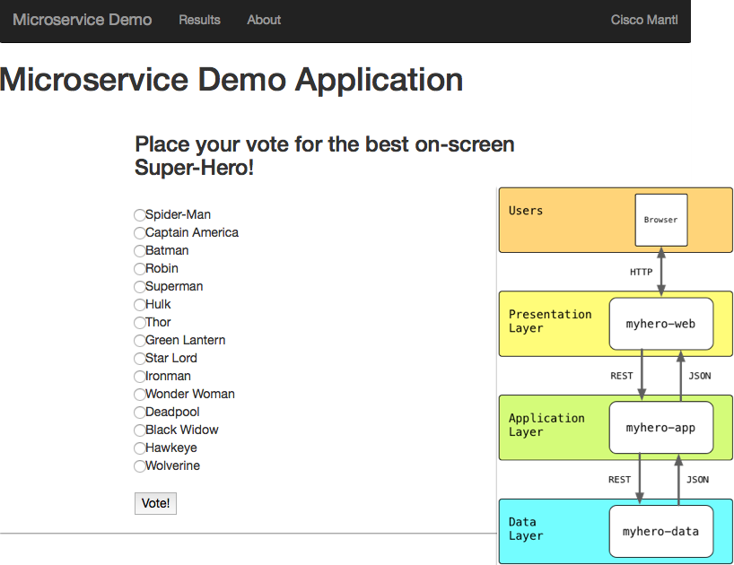

# MyHero Microservice Demo Application

This is provided as a very simple application that can be used to demonstrate
[Cisco Mantl](http://mantl.io).

The application provides a simple interface for gathering and reporting votes about the best movie superheros.

The application is built in a microservice style wrapping each service in a docker container
 that can be deployed and run in Mantl.  In its initial form the applicaiton has three services.

1. myhero/data - This service stores all the data about candidates and votes cast.
2. myhero/app - This service provides the basic logic layer for accessing and recording votes.
3. myhero/web - This is the main user interface for casting votes.

There is an optional deployment mode where votes are processed through an MQTT Server by being published by the myhero/app service, and processed by myhero/ernst service that subscribes to the queue.
In this mode, these additional services are deployed.
1. myhero/mosca - MQTT Server based on [Mosca](https://hub.docker.com/r/matteocollina/mosca/)
2. myhero/ernst - Vote processing services

All of the demo details here make use of the Mantl or Marathon APIs to build and manage applciations.  If you prefer to use the different GUIs to execute the demos, you can use the JSON files to find the details needed to configure manually.

# Optional Additional Services
A great application today allows users to interact with the service in whichever way the end user prefers.  No longer should we be satisfied with simply a web interface on a desktop or laptop.  Users are looking for options such as:
* Mobile - smartphones and tablets
* Wearables - smartwatches
* Realtime Chat
* Voice Interaction
* Gesture Based
* and more

So with this in mind, MyHero offers some optional additional services for a fuller experienece.  Check back often as the list of optional services will grow overtime.

## Cisco Spark Bot
Realtime Chat is becoming very popular with consumer as well as professional world.  Cisco Spark is an enterprise collaboration platform offering text, voice, and video options for group and one on one communciations.  MyHero now can leverage Cisco Spark to allow users to Chat with a Spark Bot to learn about the voting service, find out current results, and cast votes.

To setup the Spark Bot visit [Spark Bot Setup](./spark_setup.md)

## Prerequisites

In order to leverage this demonstration, you will need to have a Mantl cluster up and functional already.  For help with this visit the Docs site available at [http://mantl.io](http://mantl.io).  You will need to have the address for the control nodes and a username and password for an active account.

## Setup

Run `source myhero_setup` to enter and record the address, application domain, username, and password for your Mantl instance as non-persistent Environment Variables.  This means you will need to run this command everytime you open an new terminal session.

## Basic Deployment
### Install

Run `./myhero-install.sh` to deploy all three services (data, app, web) to your Mantl cluster.

After running the install it will take a 2-5 minutes for all three services to fully deploy and become "healthy".  You can monitor this in the Marathon Web GUI.

You should be able to reach the web interface for the application at `http://myhero-web.YOUR-DOMAIN` where `YOUR-DOMAIN` refers to the wildcard domain configured for Traefik.

### Uninstallation

Run `./myhero-uninstall.sh` to remove all three services from Marathon.

## Advanced Optional Deployment Using MQTT Server and Queuing
**IN DEVELOPMENT - MAY NOT BE READY FOR WIDE USAGE**

### Install

Run `./myhero-install-queue.sh` to deploy the standard three services (data, app, web) along with an MQTT Server (based on Mosca) and a vote processing service (ernst) to your Mantl cluster.

After running the install it will take a 2-5 minutes for all three services to fully deploy and become "healthy".  You can monitor this in the Marathon Web GUI.

You should be able to reach the web interface for the application at `http://myhero-web.YOUR-DOMAIN` where `YOUR-DOMAIN` refers to the wildcard domain configured for Traefik.

### Uninstallation

Run `./myhero-uninstall-queue.sh` to remove all services from Marathon.

## Basic Scaling Demo

A script is included to show how you can easily scale services with Mantl.

Run `./myhero-scaleweb.sh` to have options to change the number of web and app instances deployed.  You can scale up or down with this script.

## Advanced Demos

### Installation
If you would rather demo deploying each service independently you can use these sample curl commands.  These commands assume that you've run `source myhero_setup` to store environment variables for key details.

* Deploy the data service
  * `curl -k -X POST -u $MANTL_USER:$MANTL_PASSWORD https://$MANTL_CONTROL:8080/v2/apps -H "Content-type: application/json" -d @myhero-data.json| python -m json.tool`
* Deploy the app service
  * `curl -k -X POST -u $MANTL_USER:$MANTL_PASSWORD https://$MANTL_CONTROL:8080/v2/apps -H "Content-type: application/json" -d @myhero-app.json | python -m json.tool`
  * `curl -k -X PUT -u $MANTL_USER:$MANTL_PASSWORD https://$MANTL_CONTROL:8080/v2/apps/myhero/app?force=true -H "Content-type: application/json" -d "{\"env\": {\"myhero_data_server\": \"http://myhero-data.$MANTL_DOMAIN\", \"myhero_data_key\": \"SecureData\", \"myhero_app_key\": \"SecureApp\"}}" | python -m json.tool`
* Deploy the web service
  * `curl -k -X POST -u $MANTL_USER:$MANTL_PASSWORD https://$MANTL_CONTROL:8080/v2/apps -H "Content-type: application/json" -d @myhero-web.json | python -m json.tool`
  * `curl -k -X PUT -u $MANTL_USER:$MANTL_PASSWORD https://$MANTL_CONTROL:8080/v2/apps/myhero/web?force=true -H "Content-type: application/json" -d "{\"env\": {\"myhero_app_server\": \"http://myhero-app.$MANTL_DOMAIN\", \"myhero_app_key\": \"SecureApp\"}}" | python -m json.tool`

### Scaling a Service
* To scale up the web service
  * `curl -k -X PUT -u $MANTL_USER:$MANTL_PASSWORD https://$MANTL_CONTROL:8080/v2/apps/myhero/web -H "Content-type: application/json" -d '{"instances":5}' | python -m json.tool`

### Getting Details on a Service
* To get the details on one of the services
  * `curl -k -X GET -u $MANTL_USER:$MANTL_PASSWORD https://$MANTL_CONTROL:8080/v2/apps/myhero/web -H "Content-type: application/json" | python -m json.tool`

### Interfacing with the App Tier API

A strength of Modern Applications are that you can interact with any of the services directly through APIs if the native interface isn't desireable.  Here are some examples interacting with the app service directly.

* View the list of potential Superheros to vote for.
  * `curl -H "key: SecureApp" http://myhero-app.$MANTL_DOMAIN/options`
* View the current standings.
  * `curl -H "key: SecureApp" http://myhero-app.$MANTL_DOMAIN/results`
* Place a vote for a hero
  * `curl -H "key: SecureApp" -X POST http://myhero-app.$MANTL_DOMAIN/vote/Batman`

## MyHero Service Code and Containers
Other services are:
* Data - [hpreston/myhero_data](https://github.com/hpreston/myhero_data)
* App - [hpreston/myhero_app](https://github.com/hpreston/myhero_app)
* Web - [hpreston/myhero_web](https://github.com/hpreston/myhero_web)
* Ernst - [hpreston/myhero_ernst](https://github.com/hpreston/myhero_ernst)
  * Optional Service used along with an MQTT server when App is in "queue" mode
* Spark Bot - [hpreston/myhero_spark](https://github.com/hpreston/myhero_spark)
  * Optional Service that allows voting through IM/Chat with a Cisco Spark Bot
* Tropo App - [hpreston/myhero_tropo](https://github.com/hpreston/myhero_tropo)
  * Optional Service that allows voting through TXT/SMS messaging

The docker containers are available at
* Data - [hpreston/myhero_data](https://hub.docker.com/r/hpreston/myhero_data)
* App - [hpreston/myhero_app](https://hub.docker.com/r/hpreston/myhero_app)
* Web - [hpreston/myhero_web](https://hub.docker.com/r/hpreston/myhero_web)
* Ernst - [hpreston/myhero_ernst](https://hub.docker.com/r/hpreston/myhero_ernst)
  * Optional Service used along with an MQTT server when App is in "queue" mode
* Spark Bot - [hpreston/myhero_spark](https://hub.docker.com/r/hpreston/myhero_spark)
  * Optional Service that allows voting through IM/Chat with a Cisco Spark Bot
* Tropo App - [hpreston/myhero_tropo](https://hub.docker.com/r/hpreston/myhero_tropo)
  * Optional Service that allows voting through TXT/SMS messaging

## Other Mantl Demo Ideas

Here are some other ideas for demo's to run with Mantl.  Several of these leverage example content delivered with the Mantl code in the examples/ directory.  Others deploy Mesos frameworks using the Mantl API.

### From examples/directory

Run all these from the root directory of Mantl.  They do leverage the environment variables so be sure to run `source myhero_setup` before running these demos.

* Hello-world Example
  * `curl -k -X POST -u $MANTL_USER:$MANTL_PASSWORD https://$MANTL_CONTROL:8080/v2/apps -H "Content-type: application/json" -d @examples/hello-world/hello-world.json'`
  * `curl -k -X DELETE -u $MANTL_USER:$MANTL_PASSWORD https://$MANTL_CONTROL:8080/v2/apps/hello-world -H "Content-type: application/json" `
* Kong Example
  * `curl -k -X POST -u $MANTL_USER:$MANTL_PASSWORD https://$MANTL_CONTROL:8080/v2/apps -H "Content-type: application/json" -d @examples/kong/kong.json'`
  * `curl -k -X DELETE -u $MANTL_USER:$MANTL_PASSWORD https://$MANTL_CONTROL:8080/v2/apps/kong -H "Content-type: application/json" `
* Minecraft Example
  * `curl -k -X POST -u $MANTL_USER:$MANTL_PASSWORD https://$MANTL_CONTROL:8080/v2/apps -H "Content-type: application/json" -d @examples/minecraft/minecraft.json'`
  * `curl -k -X DELETE -u $MANTL_USER:$MANTL_PASSWORD https://$MANTL_CONTROL:8080/v2/apps/minecraft -H "Content-type: application/json" `

### DCOS Frameworks

These can be run from anywhere but do leverage the environment variables so be sure to run `source myhero_setup` before running these demos.

* List available packages
  * `curl -k -u $MANTL_USER:$MANTL_PASSWORD https://$MANTL_CONTROL/api/1/packages | python -m json.tool`
* Cassandra
  * `curl -k -u $MANTL_USER:$MANTL_PASSWORD -X POST -d "{\"name\": \"cassandra\"}" https://$MANTL_CONTROL/api/1/install  | python -m json.tool`
  * `curl -k -u $MANTL_USER:$MANTL_PASSWORD -X DELETE -d "{\"name\": \"cassandra\"}" https://$MANTL_CONTROL/api/1/install  | python -m json.tool`
* Kafka
  * `curl -k -u $MANTL_USER:$MANTL_PASSWORD -X POST -d "{\"name\": \"kafka\"}" https://$MANTL_CONTROL/api/1/install | python -m json.tool`
  * `curl -k -u $MANTL_USER:$MANTL_PASSWORD -X DELETE -d "{\"name\": \"kafka\"}" https://$MANTL_CONTROL/api/1/install | python -m json.tool`
* HDFS
  * `curl -k -u $MANTL_USER:$MANTL_PASSWORD -X POST -d "{\"name\": \"hdfs\"}" https://$MANTL_CONTROL/api/1/install | python -m json.tool`
  * `curl -k -u $MANTL_USER:$MANTL_PASSWORD -X DELETE -d "{\"name\": \"hdfs\"}" https://$MANTL_CONTROL/api/1/install | python -m json.tool`
* Elastiseach
  * `curl -k -u $MANTL_USER:$MANTL_PASSWORD -X POST -d "{\"name\": \"elasticsearch\"}" https://$MANTL_CONTROL/api/1/install | python -m json.tool`
  * `curl -k -u $MANTL_USER:$MANTL_PASSWORD -X DELETE -d "{\"name\": \"elasticsearch\"}" https://$MANTL_CONTROL/api/1/install | python -m json.tool`
* Arangodb
  * `curl -k -u $MANTL_USER:$MANTL_PASSWORD -X POST -d "{\"name\": \"arangodb\"}" https://$MANTL_CONTROL/api/1/install | python -m json.tool`
  * `curl -k -u $MANTL_USER:$MANTL_PASSWORD -X DELETE -d "{\"name\": \"arangodb\"}" https://$MANTL_CONTROL/api/1/install | python -m json.tool`

